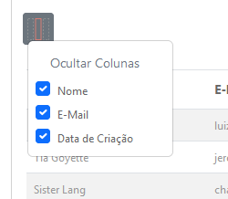

<p align="center"></p>


# Data Table Laravel - SSP (Server side process)

[](//packagist.org/packages/luizfabianonogueira/data-table-laravel-ssp)
[](//packagist.org/packages/luizfabianonogueira/data-table-laravel-ssp)
[](//packagist.org/packages/luizfabianonogueira/data-table-laravel-ssp)
[](//packagist.org/packages/luizfabianonogueira/data-table-laravel-ssp)


## Installation

You can install the package via composer:

```bash
composer require luizfabianonogueira/data-table-laravel-ssp
```

## Configuration

In the main layout include the js file
```html
<script src="{{ route('dtl.js') }}"></script>
```

You can include the css file or use your css
```html
<link href="{{ route('dtl.css') }}" rel="stylesheet" type="text/css" />
```

Note that when adding the css and js file, a route was defined to fetch the file. This route is created by the DataTableLaravel

In bootstrp/app.php add the following line:
```php
use LuizFabianoNogueira\DataTableLaravelSSP\DataTableLaravelSSPServiceProvider;

return [
    ...
    DataTableLaravelSSPServiceProvider::class,
    ...
];
```

In your model add the following trait:
```php
use LuizFabianoNogueira\DataTableLaravelSSP\Traits\DataTableLaravelSSP;

class User extends Model
{
    use DataTableLaravelSSP;
    ...
}
```


## Usage

for the dataTable to be loaded you need the following structure

```html
<table id="this-is-my-table"></table>
```

Existem duas formas de carregar seus dadosna tabela:
 - 1 Dynamic: nesse caso vamos apenas indicar qual é a model a ser utilizada. \
Nesse formato o sistema vai fazer uma abstração de sua model e utilizar uma controller propria para gerar o resultado.

```javascript
$(document).ready(function() {
    let columns = [{... ...}];
    $('#this-is-my-table').loadDataTableLaravel({
        request: {
            dynamicModel: 'App\\Models\\User'
        },
        columns:columns
    });
});
```

 - 2 Static: Nesse formato vamos indicar a rota que será utilizada para carregar os dados. \
```javascript
$(document).ready(function() {
    let columns = [{... ...}];
    $('#this-is-my-table').loadDataTableLaravel({
        request: {
            url: ' {{ route('users.index') }} '
        },
        columns:columns
    });
});
```

Mas para que isso seja possivel é necessário que a rota esteja configurada para retornar os dados no formato correto. \
Veja um exemplo abaixo:
Em sua controller adicione o seguinte código:
```php

public function listaDadosParaDataTable(Request $request): JsonResponse
    {
        $list = Model::ftlFilters()
            ->dtlSearch()
            ->dtlOrder()
            ->paginate(($request->paginate ?? 10));
        return response()->json($list);
    }
```
Observe que utilizamos ftlFilters(), dtlSearch(), dtlOrder() e  que são scopes criado pela trait caso queira personalizar crie em sua model 

Veja exemplos de scopes:

Em sua model adicione o seguinte código:
```php
    public function scopeDtlFilters($eloquent)
    {
        $request = Request::toArray();
        if (!empty($request['id'])) {
            if (is_array($request['id'])) {
                $eloquent->whereIn('id', $request['id']);
            } else {
                $eloquent->where('id', $request['id']);
            }
        }

        ...

        return $eloquent;
    }

    public function scopeDtlSearch($eloquent)
    {
        $request = Request::toArray();
        if (isset($request['search']) && !empty($request['search'])){
            $eloquent->where(function ($query) use ($request) {
                $query->where('yourTable.collumn1', 'ILIKE', '%' . $request['search'] . '%')
                    ->orWhere('yourTable.collumn2', 'ILIKE', '%' . $request['search'] . '%')
                    ->orWhere('yourTable.collumn3', 'ILIKE', '%' . $request['search'] . '%')
                    ->orWhere('yourTable.collumn4', 'ILIKE', '%' . $request['search'] . '%');
            });
        }
        return $eloquent;
    }

    public function scopeDtlOrder($eloquent)
    {
        $request = Request::toArray();
        if (isset($request['sort']) && !empty($request['sort'])) {
            $eloquent->orderBy($request['sort'], $request['direction']??'ASC');
        }
        return $eloquent;
    }
```

Em yourTable.collumn1 você deve substituir pelo nome da tabela e coluna que deseja fazer a busca.
Fique a vontade para adicionar quantos campos desejar e alterar conforme sua necessidade.
Esses metodos são apenas exemplos de como você pode fazer a busca e filtragem dos dados e podem ser utilizados por qualquer consulta em seu sistema

Agora vamos conhecer as configurações possiveis para a tabela:
A configuração é feita através de um json que deve ser passado para o plugin.

```javascript
let config = {... ...};
$('#this-is-my-table').loadDataTableLaravel(config);
```
### Campos de configuração

- **request: {... ...}**: Objeto que contem as informações necessárias para a requisição dos dados.
    - - **request - url**: string - Url da rota que será utilizada para carregar os dados.
    - - **request - method**: string - Método que será utilizado para carregar os dados. (default: GET) \
```javascript
let config = {... 
    request:{
        url: ' {{ route('users.index') }} ',
        method: 'GET',
        ...
    },
    ...
...};
```
- - **request - dynamicModel**: string - Nome da model que será utilizada para carregar os dados.
Caso utilize o dynamicModel não é necessário passar a url e method.
```javascript
let config = {... 
    request:{
        dynamicModel: 'App\\Models\\User',
        ...
    },
    ...
...};
```
- - **request - headers**: object - Cabeçalhos que serão enviados na requisição. (default: {})
 ```javascript
    let config = {...
        request:{
            headers: {
                "Authorization": "Bearer token",
                "Content-Type": "application/json",
                ...    
            },
            ...
        },
        ...
...};
```
- - **request - params**: object - Parametros que serão enviados na requisição. (default: {})
```javascript
let config = {...
    request:{
        params: {
            "param1": "value1",
            "param2": "value2",
            ...    
        },
        ...
    },
    ...
...};
```

- **columns**: array - Array de objetos que contem as informações das colunas da tabela.
```javascript
let config = {...
    columns: [{... ...}]
...};
```  
- **columns**: campos possíveis
    - - **columnTitle**: string - Título da coluna.
    - - **data**: informação que será exibido na coluna.  
    Deve corresponder ao nome da coluna no seu resultado.
    Caso seja objeto deve ser utilizado o ponto para acessar o valor. Ex: 'user.name' em *render*': 
    - - **render**: function - Função que será utilizada para renderizar o conteúdo da coluna.
    - - **hidden**: boolean - Indica se a coluna é visível. (default: true)
    - - **columnSort**: string - Defini por qual coluna será ordenado.
    - - **headerClass**: string - Classe que será aplicada no cabeçalho da coluna.
    - - **class**: string - Classe que será aplicada na coluna.
    - - **style**: string - Estilo que será aplicado na coluna.
    - - **name**: string - Nome da coluna.(alias)

```javascript
let config = {
    columns: [
        {
            data: 'id',
            hidden: true,
        },
        {
            columnTitle: 'Nome',
            data: 'name',
            columnSort: 'name',
            headerClass: 'text-center',
            class: 'text-center',
            style: 'width: 100px',
            name: 'nameAlias',
            render: function (data) {
                return '<span class="badge badge-green">'+data+'</span>';
            }
        }
    ],
    ...
};
```

- **table**: configurações da tabela
    - - **table - txtNoResult**: string - Mensagem que será exibida quando não houver registros. (default: 'Sem resultados')

```javascript
let config = {...
    table:{
        txtNoResult: 'Nenhum registro encontrado',
        ...
    },
    ...
...};
```


- **searchBox**: configurações da caixa de pesquisa
    - - **show**: boolean - Indica se a caixa de pesquisa será exibida. [obrigatório].
    - - **boxId**: string - Id da caixa de pesquisa. caso null o sistema irá criar um id automaticamente.
    - - **placeholder**: string - Texto que será exibido na caixa de pesquisa. (default: 'Pesquisar')
    - - **class**: string - Classe que será aplicada na caixa de pesquisa.
    - - **style**: string - Estilo que será aplicado na caixa de pesquisa.
    - - **autoSearch**: boolean - Indica se a pesquisa será feita automaticamente. (default: true)
    - - **autoSearchOnEnter**: boolean - Indica se a pesquisa será feita ao pressionar a tecla enter. (default: true)
    - - **autoSearchDelay**: number - Tempo de espera para realizar a pesquisa. (default: 500)
    - - **autoSearchMinLength**: number - Quantidade mínima de caracteres para realizar a pesquisa. (default: 3)
    - - **searchInput**: object - Configurações da caixa de pesquisa.
        - - **searchInput - id**: boolean - Indica se a caixa de pesquisa terá um id. (default: false)
        - - **searchInput - class**: string - Classe que será aplicada na caixa de pesquisa.
        - - **searchInput - style**: string - Estilo que será aplicado na caixa de pesquisa.


```javascript
let config = {...
    searchBox: {
        show: true,
        boxId:null,
        placeholder: 'Pesquisa rapida',
        class: 'form-control',
        style: 'width: 200px',
        autoSearch: true,
        autoSearchOnEnter:true,
        autoSearchDelay: 500,
        autoSearchMinLength: 3,
        searchInput:{
            id: false,
            class: 'form-control',
            style: 'max-width: 200px;'
        }
    }
};
```


- **buttons**:
- - **buttonShowColumns**: oculatar colunas
```javascript
let config = {...
        buttons: {
            buttonShowColumns: {
                show: true,
            },
        },
        ...
};
```


- - **buttonCSV**: em desenvolvimento
- - **buttonPDF**: em desenvolvimento
- - **buttonXLS**: em desenvolvimento


- **translate**:

```javascript
let config = {...
        texts:{
            searchBox:{
                placeholder: 'Pesquisa rápida',
                    buttonText: 'Pesquisar'
            },
            buttonShowColumns:{
                hoverText: 'Exibir/Ocultar Colunas',
                    title: 'Ocultar Colunas'
            },
            pagination:{
                first: 'Primeiro',
                    last: 'Último',
                    next: 'Próximo',
                    prev: 'Anterior',
                    showing: 'Exibindo',
                    records: 'registros',
                    to: 'ao',
                    outOf: 'de'
            },
        }
        ...
};
```


### License: LGPL-3.0-or-later

___
___

## Contact & Support

[](https://www.linkedin.com/in/luiz-fabiano-nogueira-b20875170/)
[](https://api.whatsapp.com/send?phone=5548991779088)
[](https://github.com/LuizFabianoNogueira)
[](https://packagist.org/packages/luizfabianonogueira/)

📞 **Phone:** [+5548991779088](tel:+5548991779088)  
✉️ **Email:** [luizfabianonogueira@gmail.com](mailto:luizfabianonogueira@gmail.com)

---

### Support My Work

If you enjoyed this project and would like to support my work, any donation via Pix is greatly appreciated!  
Feel free to donate using one of the following Pix keys:

💳 **Email Pix Key:** `luizfabianonogueira@gmail.com`  
📱 **Phone Pix Key:** `48991779088`

Thank you for your support!
